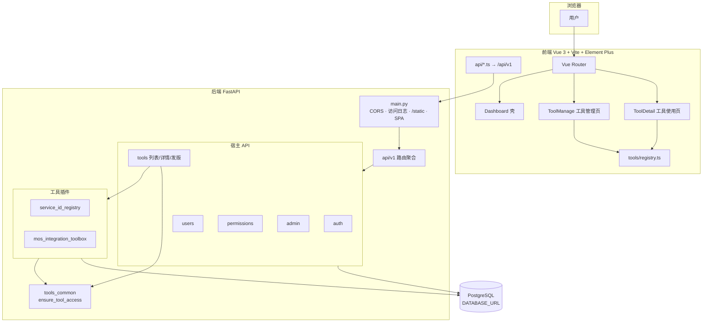

# MOS 综合工具箱（Toolbox）

统一壳层下的多工具 Web 平台：工具目录、授权、治理与使用记录；各工具以**插件**形式挂载 API 与前端面板（Vue 3 + FastAPI）。

## 架构

下图在 GitHub 网页上由 Mermaid 渲染；亦可使用仓库内导出的静态图或 PDF：`docs/architecture-diagram.png`（或 `.jpg`）、`docs/architecture-diagram.pdf`。可编辑源：`docs/architecture-diagram.mmd`。



## 快速开始（开发）

**前置**：Node.js（前端）、Python 3（后端）；建议在 `backend` 下使用虚拟环境并安装 `requirements.txt`。

**环境变量（后端）**：发布/部署前请将 `backend/.env.example` 复制为 `backend/.env`，填写 **`DATABASE_URL`**（及生产环境下的 **`SECRET_KEY`** 等）。

在仓库根目录双击或执行：

```bat
start-dev.cmd
```

将并发启动后端（默认 `http://127.0.0.1:3001`）与前端 Vite（默认 `http://127.0.0.1:3000`，API 由 Vite 代理到后端）。环境变量 `TOOLBOX_BACKEND_PORT` / `TOOLBOX_FRONTEND_PORT` 可改端口（需与 `frontend/vite.config.ts` 代理一致）。

**数据库模式（开发启动）**：

- `start-dev.cmd`（默认）会以 **SQLite** 启动后端（`backend/app.db`），适合开发机快速联调。
- 若要按部署形态联调 PostgreSQL，可执行：`start-dev.cmd -Database postgres`（此时读取 `backend/.env` 中的 `DATABASE_URL`）。

**部署与发布**：仍以 **PostgreSQL** 为标准；工作区内的 `backend/app.db` 不用于发布机。

## 文档

完整说明、目录结构与 Agent 协作约定见 **`docs/README.md`**（从 **`docs/PROJECT_AND_AGENT_GUIDE.md`** 读起）。

## 远程仓库（Git）

**默认 GitHub 地址**：`https://github.com/mjnn/Toolbox.git`（网页：[mjnn/Toolbox](https://github.com/mjnn/Toolbox)）。本机已克隆并配置过 `origin` 时，在仓库根目录提交后执行 **`git push`** 或 **`git push origin main`** 即可。

更完整的说明（克隆、补配 `remote`、SSH）见 **`docs/REMOTE.md`**。

## 持续集成（GitHub）

推送到 **`main` / `master`** 或向这两支开 **Pull Request** 时，GitHub Actions 会并行执行：

- **Tool manifests & plugin boundaries**：`python scripts/validate_tool_manifests.py` 与 `python scripts/check_tool_plugin_boundaries.py`（与 `scripts/run-ci-tool-checks.ps1` 等价）。
- **Frontend build**：`frontend` 下 `pnpm install --frozen-lockfile` 与 `pnpm run build`。

工作流文件：`.github/workflows/ci.yml`。也可在 Actions 里 **手动运行**（`workflow_dispatch`）。

## 常用脚本（仓库根目录 PowerShell）

| 脚本 | 说明 |
|------|------|
| `scripts/start-dev.ps1` | 开发启动（由 `start-dev.cmd` 调用） |
| `scripts/run-ci-tool-checks.ps1` | 合并前：manifest + 插件边界检查（与 CI 中 Python 两步一致） |
| `scripts/build-release.ps1` | 构建 Windows 便携包至 `release/toolbox-portable`；若存在 `backend/.env` 会复制为产物内 `.env`（详见 `docs/PORTABLE_PACKAGING_AGENT_RUNBOOK.md`） |

## 仓库布局（精简）

| 目录 | 说明 |
|------|------|
| `backend/` | FastAPI 应用入口 `main.py`、宿主 API、工具插件 `app/tools/plugins/` |
| `frontend/` | Vue SPA、`src/tools/registry.ts` 注册工具 UI |
| `contracts/` | `tool.manifest.schema.json` 等契约 |
| `docs/` | 规范与流程文档 |
| `scripts/` | 启动、CI、发布、数据迁移脚本 |
| `ref/` | 参考与归档（旧版 `toolboxweb`、本地备份等，见 `ref/README.md`） |

根目录 `.gitignore` 已排除 `backend/.venv`、`frontend/node_modules`、`backend/dist`、`release/` 等本地与构建产物。

**前端包管理**：以 **`frontend/pnpm-lock.yaml`** 为准，使用 **`pnpm`**（`pnpm install` / `pnpm dev`）。`package.json` 中的 **`packageManager`** 便于与团队 pnpm 版本对齐。
