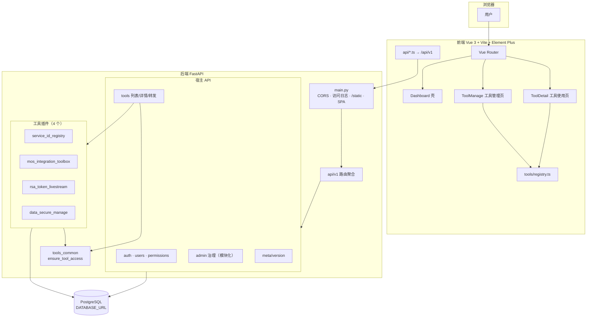

# MOS 综合工具箱（Toolbox）

统一壳层下的多工具 Web 平台：工具目录、授权、治理与使用记录；各工具以**插件**形式挂载 API 与前端面板（Vue 3 + FastAPI）。

**宿主**负责认证、工具目录、权限审批、管理聚合、审计与通知；**工具**在门禁内实现业务 API 与可选前端面板。详见 [`docs/PROJECT_AND_AGENT_GUIDE.md`](docs/PROJECT_AND_AGENT_GUIDE.md)。

## 内置工具

| `tool_key` | 说明 |
|------------|------|
| `service-id-registry` | 服务 ID 治理 |
| `mos-integration-toolbox` | MOS 集成工具箱 |
| `rsa-token-livestream` | RSA Token 直播 |
| `data-secure-manage` | 数据安全管理 |

前端注册：`frontend/src/tools/registry.ts`；后端插件：`backend/app/tools/plugins/<tool_key>/`。

## 架构

浏览器 → Vue 壳（Dashboard / ToolDetail / ToolManage）→ FastAPI 宿主 API + 工具插件 → PostgreSQL。

- **交互式总览图**：[`docs/PROJECT_ARCHITECTURE_OVERVIEW.html`](docs/PROJECT_ARCHITECTURE_OVERVIEW.html)
- **抽象边界图**：[`docs/PROJECT_ARCHITECTURE_ABSTRACT.html`](docs/PROJECT_ARCHITECTURE_ABSTRACT.html)
- **用户旅程图**：[`docs/USER_JOURNEY_SYSTEM_WORKFLOW.html`](docs/USER_JOURNEY_SYSTEM_WORKFLOW.html)


```mermaid
flowchart TB
  subgraph Browser["浏览器"]
    U["用户"]
  end

  subgraph FE["前端 Vue 3 + Vite + Element Plus"]
    R["Vue Router"]
    D["Dashboard 壳"]
    TD["ToolDetail 工具使用页"]
    TM["ToolManage 工具管理页"]
    REG["tools/registry.ts"]
    APIF["api/*.ts → /api/v1"]
  end

  subgraph BE["后端 FastAPI"]
    M["main.py\nCORS · 访问日志 · /static · SPA"]
    AGG["api/v1 路由聚合"]
    subgraph HostAPI["宿主 API"]
      AU["auth · users · permissions"]
      TL["tools 列表/详情/转发"]
      AD["admin 治理（模块化）"]
      VM["meta/version"]
    end
    TC["tools_common\nensure_tool_access"]
    subgraph Plugins["工具插件（4 个）"]
      P1["service_id_registry"]
      P2["mos_integration_toolbox"]
      P3["rsa_token_livestream"]
      P4["data_secure_manage"]
    end
  end

  PG[("PostgreSQL\nDATABASE_URL")]

  U --> R
  R --> D
  R --> TD
  R --> TM
  TD --> REG
  TM --> REG
  APIF --> M
  M --> AGG
  AGG --> HostAPI
  TL --> TC
  TL --> Plugins
  Plugins --> TC
  HostAPI --> PG
  Plugins --> PG
```

## 项目影响

| 指标 | 数据 |
|------|------|
| 上线速度 | 单人 3 天完成主体上线 |
| 架构效率 | 90% 代码压缩比——统一壳层下工具插件化挂载，消除重复基础设施 |
| 服务规模 | 覆盖 20–60 人团队日常工具需求（数据治理、RSA Token、安全管理等） |

## 交付形态

| 场景 | 方式 | 文档 |
|------|------|------|
| **内网 Windows** | `scripts/build-release.ps1` 生成便携包 `release/toolbox-portable`（PyInstaller + 前端 dist） | [`docs/PORTABLE_PACKAGING_AGENT_RUNBOOK.md`](docs/PORTABLE_PACKAGING_AGENT_RUNBOOK.md) |
| **内网分拆进程** | 便携包可选 split 启停（宿主 + 多工具进程） | [`docs/PORTABLE_SPLIT_DEPLOY_RUNBOOK.md`](docs/PORTABLE_SPLIT_DEPLOY_RUNBOOK.md) |
| **外网 ECS** | Docker 分拆镜像：`tool_box_host` + `tool_box_tools`（默认） | [`docs/EXTERNAL_PUBLIC_RELEASE.md`](docs/EXTERNAL_PUBLIC_RELEASE.md)、[`docs/ECS_SPLIT_DEPLOY_RUNBOOK.md`](docs/ECS_SPLIT_DEPLOY_RUNBOOK.md) |

外网与内网共用同一 PostgreSQL；外网默认仅展示 `service-id-registry`（可见性由 Admin「内外网工具可见性」或 `TOOLBOX_VISIBLE_TOOL_KEYS` 治理，见 [`docs/TOOL_VISIBILITY_ENV_RUNBOOK.md`](docs/TOOL_VISIBILITY_ENV_RUNBOOK.md)）。

**版本治理**：部署时写入 `TOOLBOX_VERSION` / `TOOLBOX_SPEC_REVISION` / `TOOLBOX_CHANGELOG` 等环境变量；宿主与工具通过 `GET /api/v1/meta/version` 自描述；管理端在「版本管理 → 从工具接口同步版本」记录历史（不再使用手工发版录入）。

## 快速开始（开发）

**前置**：Node.js（前端）、Python 3（后端）；建议在 `backend` 下使用虚拟环境并安装 `requirements.txt`。

**环境变量（后端）**：将 `backend/.env.example` 复制为 `backend/.env`，填写 **`DATABASE_URL`**（及生产环境下的 **`SECRET_KEY`** 等）。

在仓库根目录双击或执行：

```bat
start-dev.cmd
```

将并发启动后端（默认 `http://127.0.0.1:3001`）与前端 Vite（默认 `http://127.0.0.1:3000`，API 由 Vite 代理到后端）。环境变量 `TOOLBOX_BACKEND_PORT` / `TOOLBOX_FRONTEND_PORT` 可改端口（需与 `frontend/vite.config.ts` 代理一致）。

**数据库模式（开发启动）**：

- `start-dev.cmd`（默认）以 **SQLite** 启动（`backend/app.db`），适合开发机快速联调。
- 按部署形态联调 PostgreSQL：`start-dev.cmd -Database postgres`（读取 `backend/.env` 中的 `DATABASE_URL`）。

**部署与发布**：生产与便携包均以 **PostgreSQL** 为标准；工作区内的 `backend/app.db` 不用于发布机。

## 文档

完整说明、目录结构与 Agent 协作约定见 **[`docs/README.md`](docs/README.md)**（从 **[`docs/PROJECT_AND_AGENT_GUIDE.md`](docs/PROJECT_AND_AGENT_GUIDE.md)** 读起）。

## 远程仓库（Git）

**默认 GitHub 地址**：`https://github.com/mjnn/Toolbox.git`（网页：[mjnn/Toolbox](https://github.com/mjnn/Toolbox)）。

克隆与 `origin` 配置见 **[`docs/REMOTE.md`](docs/REMOTE.md)**。

## 持续集成（GitHub）

推送到 **`main` / `master`** 或向这两支开 **Pull Request** 时，GitHub Actions 会并行执行：

- **Tool manifests & plugin boundaries**：`python scripts/validate_tool_manifests.py` 与 `python scripts/check_tool_plugin_boundaries.py`（与 `scripts/run-ci-tool-checks.ps1` 等价）。
- **Frontend build**：`frontend` 下 `pnpm install --frozen-lockfile` 与 `pnpm run build`。

工作流：`.github/workflows/ci.yml`。也可在 Actions 里 **手动运行**（`workflow_dispatch`）。

合并前本地建议：

```powershell
powershell -File scripts/run-ci-tool-checks.ps1
cd frontend; pnpm install --frozen-lockfile; pnpm run build
```

## 常用脚本（仓库根目录）

| 脚本 | 说明 |
|------|------|
| `scripts/start-dev.ps1` | 开发启动（由 `start-dev.cmd` 调用） |
| `scripts/run-ci-tool-checks.ps1` | manifest + 插件边界检查（与 CI 一致） |
| `scripts/build-release.ps1` | 构建 Windows 便携包至 `release/toolbox-portable` |
| `scripts/docker-build-push-split.ps1` | 构建并推送 ECS 分拆镜像（host + tools） |
| `scripts/ecs-deploy-split.sh` | ECS 分拆 compose 部署 |

## 仓库布局（精简）

| 目录 | 说明 |
|------|------|
| `backend/` | FastAPI 入口 `main.py`、宿主 API、工具插件 `app/tools/plugins/` |
| `frontend/` | Vue SPA、`src/tools/registry.ts` 注册工具 UI |
| `contracts/` | `tool.manifest.schema.json` 等契约 |
| `docs/` | 规范、Runbook、架构 HTML 图 |
| `deploy/` | ECS compose 与部署辅助说明 |
| `scripts/` | 启动、CI、发布、迁移脚本 |
| `ref/` | 参考与归档（见 `ref/README.md`） |

根目录 `.gitignore` 已排除 `backend/.venv`、`frontend/node_modules`、`backend/dist`、`release/` 等本地与构建产物。

**前端包管理**：以 **`frontend/pnpm-lock.yaml`** 为准，使用 **`pnpm`**（`pnpm install` / `pnpm dev`）。
